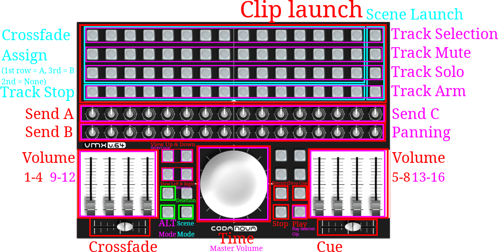

# Codanova VMX V64 Control Surface

## Installation:
- Unplug your VMX V64.
- Get it upside-down.
- Change the dipswitches to this position: 
  
- Plug it back on.
- Download the latest release.
- Extract the folder to `C:\ProgramData\Ableton\Live 12`*(depends on your edition of Ableton)*`\Resources\MIDI Remote Scripts`.
- **Rename it to VMX_V64**
- Should look like `MIDI Remote Scripts̀\VMX_V64\*`(* contains all the files, such as VMX_V64.py)
- In Ableton, go to Preferences -> Link MIDI -> (lower part of the window) Enable Input and Output for your VMX V64 (if it's not detected, restart Ableton).
- In the uppert part of the Link MIDI Preference page, you can assign Control Surface. Select the VMX V64 in Input and Output, and in the Control Surface section, you should be able to set it to `VMX V64` (if it's not there, you failed the installation).
- Enjoy! (See the layout below)

## Introduction:

[MIDI](https://en.wikipedia.org/wiki/MIDI) is a protocol from the 80s, made to carry datas, mainly used for musical instruments, and that let you do chains of MIDI equipment. This protocol allows up to 16 Channels that can have 128 Control Change messages, from 0 to 128. You can also pass notes, and include it's [velocity, aftertouch, and a lot of informations](https://en.wikipedia.org/wiki/Keyboard_expression). 
While lurking online, I found the brand [Codanova](http://codanova.over-blog.com/), which closed in 2012. This brand aimed to do MDI Controller for [VJing](https://en.wikipedia.org/wiki/VJing), but it can also be used as a controller for [music software (DAWs)](https://en.wikipedia.org/wiki/Digital_audio_workstation). I playing music live is something really fun, and can be achieved in different way, with [traditional turntables](https://www.youtube.com/watch?v=hoyCaeT_tuo) or with launching clips and tweaking effects using [MIDI controllers](https://www.youtube.com/watch?v=mRfwdJx0NDE) (and you sometimes have [artists doing both](https://www.youtube.com/watch?v=KHQDGohpBsQ)). 
I managed to get two of Codanova products second hand, the [Codanova VMX V64](http://codanova.over-blog.com/article-codanova-vmx-v64-available-83628397.html), and the [Codanova VMX VJ](http://codanova.over-blog.com/article-32478755.html). 
You can directly control DAWs with binding MIDI controls directly to it, but for a full integration for software such as Ableton, you have to look for [Surface Control](https://help.ableton.com/hc/en-us/articles/209774285-Using-Control-Surfaces). 
As said in the Logbook, there are not much ressources availables to create Surface Control, so it's a lot of trying and failing, and blindly guessing how a function would work.

## Current functions and layout:

With the 16x4 buttons matrix, you can launch clips, and the 16x2 knobs can manage the Send A & B, while the faders manage volume (0-8). 
The jog wheel can manage time, and you can move the view with 4 buttons (see scheme below). 
Some buttons are also binded to Play, Stop, Stop Clips and Record. 

I managed to create an ALT button that changes the first row of buttons to manage the selection of tracks, the second row of buttons can now manage the mute, the third solo, and the fourth arm the track. 
The 16x2 knobs manage send C and pan in ALT mode. 
The 8 faders manage the 8 other volume tracks in ALT mode (8-16). 
The jog wheel manages the master volume in ALT mode. 
The view buttons now manage the clip selection in ALT mode, and the play button launches the currently selected clip in ALT mode. 
The first crossfader can now manage the crossfade (have to change the view to add crossfaders selection and viewing), while the second one manages the Cue (preview) level. 

I've also managed to create a scene mode.
In scene mode, the first 15 buttons bind the track to crossfade A, the second row (to 15) remove the binding, and the third row bind to crossfade B. The last row stop a track, and the last column launch scenes (1 to 4 (depending on the view)) 

*Current layout:*

## What's next?
One of the next step would be to preview the clips with changing the color of buttons. Though it's not possible, because the Input of these devices goes directly to the Output, and creates a nasty loop. 
I've managed to get in touch with someone close to Codanova, and got some interesting ressources. 

I've started to work on the Control Surface for the VMX VJ, based on this Control Surface. I worked on a super cool menu and submenu system, that works great. 
Ultimate goal for this one will be to add and tweak effects.

## More
[Log book of this project](LogBook.md) 
[VMX VJ Surface Control](https://github.com/Meb-Do-Stuff/VMX_VJ)
